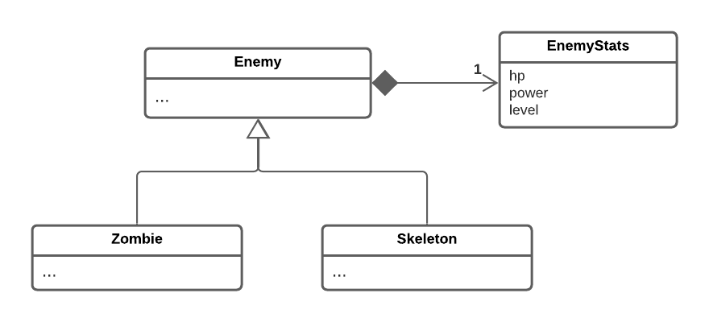

# LPOO_34 - Terraria

[PROJECT DESCRIPTION]

## Implemented Features
[WRITE HERE WHAT YOU IMPLEMENT IN CONTROLLER/VIEWERS]

**Element drawing** - Each element of the game is drawn with its own
image, represented by characters and saved in text files

## Planned Features
[WRITE HERE WHAT WE WILL DO AFTER THE FIRST DELIVERY]

## Design
[WRITE THERE EACH TIME YOU HAVE TO SOLVE A PROBLEM]

### Model-View-Controller
#### Problem in context
We needed a way to represent the data, actions, input and interface of the game,
in an organized way that separates those responsibilities.

#### The Pattern
For this problem, we used the **Model-View-Controller** pattern. This way,
we stored the game data in the Model, the logic/rules of the game in the Controller and
the interface in the Viewer. Additionally, we also created a package for the GUI
since it had a different responsibility from the Viewer

#### Implementation
To implement this pattern, we created four packages: Model, View, Controller
and GUI. The implemented GUI uses Lanterna

The way they interact can be analyzed in the following diagram:

The respective packages can be found [here](https://github.com/FEUP-LPOO-2021/lpoo-2021-g34/tree/master/src/main/java)

#### Consequences
Using this pattern, we can separate the logic behind the input, processing and
interface of the game, allowing to clearly implement those modules and
making it significantly easier to make changes on them, without having to change
the others

### Elements Stats

#### Problem in context

There were some classes (namely, items and enemies) who had
a lot of primitives all related to its stats. This is a smell
called **primitive obsession**

#### The Pattern
To solve this problem, for each class falling in these circumstances,
we created a Stats class which stores all the primitives for the relevant
information

#### Implementation
This is an implementation of the *Replace Type Code with Class* refactoring

Below, there's a diagram showing how this was done in the Zombie class

The relevant classes for this pattern can be found in the following files:

- [Enemy](https://github.com/FEUP-LPOO-2021/lpoo-2021-g34/blob/master/src/main/java/Model/elements/enemies/Enemy.java)

- [EnemyStats](https://github.com/FEUP-LPOO-2021/lpoo-2021-g34/blob/master/src/main/java/Model/elements/enemies/EnemyStats.java)

- [Tool](https://github.com/FEUP-LPOO-2021/lpoo-2021-g34/blob/master/src/main/java/Model/items/tools/Tool.java)

- [ToolStats](https://github.com/FEUP-LPOO-2021/lpoo-2021-g34/blob/master/src/main/java/Model/items/tools/ToolStats.java)

- [Food](https://github.com/FEUP-LPOO-2021/lpoo-2021-g34/blob/master/src/main/java/Model/items/food/Food.java)

- [FoodStats](https://github.com/FEUP-LPOO-2021/lpoo-2021-g34/blob/master/src/main/java/Model/items/food/FoodStats.java)

#### Consequences
The use of this pattern allows for:
- The model classes don't become overflowed by primitives, becoming more
readable and smaller
  
- By grouping all the stats to one class we can have all the stat generation
together, making it easier to change, for example, how much health a zombie 
has, according to its level
  
- We have one more class per type of game element, but that's reasonable when
taking into consideration the quantity of their subclasses, saving us a lot of lines

However, this also adds another code smell, **Data class**, since all
these Stats classes are mainly or only composed by primitives and their
getters/setters. Even with this problem, we believe it's worth it to use
the pattern.

### Constructors with Template Methods

#### Problem in Context
We had some abstract classes with attributes which are only defined
by their subclasses. Having that attribute in all the subclasses would
inflict against **The Release Reuse Equivalency Principle**, since we
would be writing almost identical in each subclass

#### The Pattern
To solve this problem, we used the **Form Template Method** refactoring
to each class falling under this circumstances. This way, we only have the
relevant attributes in the abstract class and use abstract methods (which will
be overridden in the subclasses) to initialize/calculate those

#### Implementation
The following image shows how this pattern can be implemented in each class:

Below, we're linking the classes where this was applied:

- [Enemy](https://github.com/FEUP-LPOO-2021/lpoo-2021-g34/blob/master/src/main/java/Model/elements/enemies/Enemy.java)
- [Block](https://github.com/FEUP-LPOO-2021/lpoo-2021-g34/blob/master/src/main/java/Model/elements/blocks/Block.java)
- [Item](https://github.com/FEUP-LPOO-2021/lpoo-2021-g34/blob/master/src/main/java/Model/items/Item.java)

#### Consequences
The use of this pattern prevents duplicate code and allows us to easily
change how the class attributes are calculates, when they depend on subclass
implementations

## Known Code Smells and Refactoring Suggestions
[DO IT IN THE END]

## Testing
[PUT SCREENSHOTS OF THE TESTS IN THE END]

## Self-Evaluation
Bruno Rosendo: 1/3
Francisco Colino: 1/3
João Mesquita: 1/3
