# LPOO_34 - Terrarius

An open-world adventure game where our hero must defeat enemies to unlock new areas and unlock new more powerful tools.
In this pseudo-random infinitely generated world our hero will have to deal with different enemies by either slaying them or
by manipulating the world with the powers to break and place blocks. As the player progresses more 
challenging enemies will appear and the tools at the disposal of the hero will evolve and improve.

## Implemented Features

**Element drawing** - Each element of the game is drawn with its own
image, represented by characters and saved in text files. Elements can be represented by static images 
or animated ones.

**Map Drawing** - The maps are loaded from a file, which tells their aspect and composition.

**Arena** - Has the maps, enemies and hero of the game.

**Arena Loading** - The composition of the arena is done by loading different files. These contain representation of 
the terrain of the mapZone, the enemies and the hero, allowing the modification of the arena to be easily done.

**Hero movement** - The hero can move around the map, restricted by collision with blocks, according to the inputs from the 
player, up, down, left and right arrows. These movements consist of lateral movements and vertical block climbing.

**Enemy movement** - Enemies move towards the hero along the map but can't move climb, just fall down, therefore they can 
sometimes be trapped. They also have a view distance, from which they start following and attacking the hero.

**Items** - Items that the hero can buy and hold in his hand. They can be either tools (sword, pickaxe, etc.)
or buffs (food for regeneration and potions, for example).

**Toolbar** - Stores and shows the items that the hero buys. The player can choose what to use with the keyboard numbers

**Breaking blocks** - The hero, when equipped with the proper tool, is able to break blocks from the map.
Different blocks have different hardnesses, meaning that a tool might not be able to break all blocks.

**Placing blocks** - The hero is able to place blocks, modifying the map.

**Multiple maps** - The arena is able to contain several maps, but will only display one at a time.
These maps can have been already created or can be newly generated according to the hero's level. 
Therefore, providing a sense of progression to the game.

**Combat system** - Enemies will be able to inflict damage on the hero through physical contact, and the hero
will have to fight them off with different tools.

**Healing** - If the hero has taken damage it may consume food to restore some of the lost HP.

**Item shop** - The hero is able to buy items in a shop, by pressing 'B' and consuming credits gained
by leveling up.

**Tree Evolution System** - The hero may upgrade his stats by consuming credits gained by leveling up.
The tree can be open by pressing 'Tab'.

**Menu** - The game has some interactive menus, including the main menu presented at the start
of the game.

## Planned Features

Some features that would have been good to implement but weren't for time reasons:

- **Losing and pause screens**
- **Attack animations**
- **More maps, items and enemies**

## Design

### Model-View-Controller
#### Problem in context
We needed a way to represent the data, actions, input and interface of the game,
in an organized way that separates those responsibilities.

#### The Pattern
For this problem, we used the **Model-View-Controller** pattern. This way,
we stored the game data in the Model, the logic/rules of the game in the Controller and
the interface in the Viewer. Additionally, we also created a package for the GUI
since it had a different responsibility from the Viewer

#### Implementation
To implement this pattern, we created four packages: Model, View, Controller
and GUI. The implemented GUI uses Lanterna. Additionally, we added packages for
'Utils' and 'States'

The way they interact can be analyzed in the following diagram:

The respective packages can be found [here](https://github.com/FEUP-LPOO-2021/lpoo-2021-g34/tree/master/src/main/java/com/lpoo/terrarius)

#### Consequences
Using this pattern, we can separate the logic behind the input, processing and
interface of the game, allowing to clearly implement those modules and
making it significantly easier to make changes on them, without having to change
the others

### State Pattern

#### Problem in Context
We needed a way to alter the program's behaviour mid-game, while executing the main loop
continuously. Additionally, we sometimes needed to come back to a previous state of the program.

#### The Pattern
For this, we used the **State Pattern**, which suggests the creation of new classes for
every possible state of the game, and extract all specific behaviours into those classes.

This way, the original object (in this case, an instantiation of the 'com.lpoo.terrarius' class)
just needs to keep a reference to its current state. The states' classes will also take care
of the transitions into other states.

Additional information can be found [here](https://refactoring.guru/design-patterns/state)

#### Implementation

Our idea of implementation follows the given diagram:

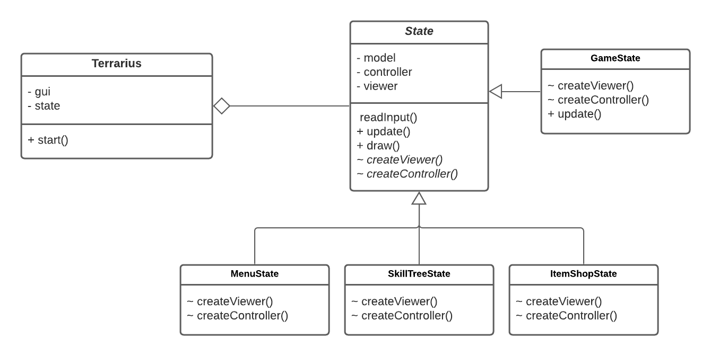

The code related to the pattern can be found in the following URLs:

- [States Package](https://github.com/FEUP-LPOO-2021/lpoo-2021-g34/tree/master/src/main/java/com/lpoo/terrarius/states)
- [Terrarius Class](https://github.com/FEUP-LPOO-2021/lpoo-2021-g34/blob/master/src/main/java/com/lpoo/terrarius/Terrarius.java)

#### Consequences

Using this patter, we can have an object whose behaviour depends on the state of the game, without
using any conditionals or duplicating any code. 

We can also easily introduce new states without changing any of the code that's already implemented.
The code also becomes more readable, understandable and clear.

### Game Loop Pattern

#### Problem in Context
We needed a way to faithfully update the game without depending on the CPU's clock
while also rendering images as fast as possible, so the player gets an experience as smooth
as his computer allows him

#### The Pattern
The pattern (and further explanation) used can be found in the following website,
in the *Play Catch up* section:

https://gameprogrammingpatterns.com/com.lpoo.terrarius-loop.html

With this strategy, we have a *lag* variable counting the time passing in
each iteration and, if that variable is greater than the amount of time defined
to pass between updates (currently, 16ms), we update the actions that depend on time.
The rendering methods, on the other hand, are always called as fast as the CPU
lets them.

This way, we can have a smoother gameplay in a faster computer without
compromising the speed of the game

#### Implementation
Below, we can find a flowchart which can help visualize this:

The pattern was implemented like above and can be found
in the following method:

- [Game Loop](https://github.com/FEUP-LPOO-2021/lpoo-2021-g34/blob/74abf0e061f93e05fba145387780eacb6e99a0b7/src/main/java/com/lpoo/terrarius/Terrarius.java#L33)

#### Consequences
The use of this pattern has a lot of advantages, like:

- We can have the framerate depend almost solely on the speed of the computer. This way,
a fast computer might have 60 fps while a slow computer has 30 fps
- The speed of the game is independent of the speed of the computer. By updating
the logic of the game based on the current time, fast and slow computers will
update their games almost at the same time, even with different framerates
- The game won't break or slow down even if a game cycle takes more time than the theoretical
time between updates, which could happen if we simply waited for the remaining time
until the next frame (with fixed framerate)
  
However, this method also has disadvantages, since the game will update at a fixed
time step, but will render arbitrarily:

- Since the render methods will not be in sync with the update methods, faster
machines might often render moving objects at the same position they were in the last frame,
seeing that no in-game time has passed, not gaining much smoothness in the end
- The problem above can be atoned with an extrapolation method, which will add
a lot of smoothness to the motion. However, in some cases, this strategy can fail,
resulting in objects being rendered out of place (for example, if the object is blocked
by an obstacle). This happens because we're pretty much guessing where the object will be
in X milliseconds from now
- The extrapolation method turned out difficult to implement with the Lanterna GUI, since,
almost always, the elements only move one unit per X updates, meaning that we can't divide
their movements any further, so it was not implemented
  
Even with these problems, the pattern is still useful in our implementation.
On one hand, the high-end users still get the best experience currently possible. 
On the other hand, we assure that the low-end users don't lose any updates on their game
  

### Elements Stats

#### Problem in Context

There were some classes (namely, items, enemies and hero) who had
a lot of primitives all related to its stats. This is a smell
called **primitive obsession**

#### The Pattern
To solve this problem, for each class falling in these circumstances,
we created a Stats class which stores all the primitives for the relevant
information

#### Implementation
This is an implementation of the *Replace Type Code with Class* refactoring

Below, there's a diagram showing how this was done in the Enemy class

The relevant classes for this pattern can be found in the following files:

- [Enemy](https://github.com/FEUP-LPOO-2021/lpoo-2021-g34/blob/master/src/main/java/com/lpoo/terrarius/model/game/elements/enemies/Enemy.java)

- [EnemyStats](https://github.com/FEUP-LPOO-2021/lpoo-2021-g34/blob/master/src/main/java/com/lpoo/terrarius/model/game/elements/enemies/EnemyStats.java)

- [Tool](https://github.com/FEUP-LPOO-2021/lpoo-2021-g34/blob/master/src/main/java/com/lpoo/terrarius/model/game/items/tools/Tool.java)

- [ToolStats](https://github.com/FEUP-LPOO-2021/lpoo-2021-g34/blob/master/src/main/java/com/lpoo/terrarius/model/game/items/tools/ToolStats.java)

- [Buff](https://github.com/FEUP-LPOO-2021/lpoo-2021-g34/blob/master/src/main/java/com/lpoo/terrarius/model/game/items/buffs/Buff.java)

- [BuffStats](https://github.com/FEUP-LPOO-2021/lpoo-2021-g34/blob/master/src/main/java/com/lpoo/terrarius/model/game/items/buffs/BuffStats.java)

- [Hero](https://github.com/FEUP-LPOO-2021/lpoo-2021-g34/blob/master/src/main/java/com/lpoo/terrarius/model/game/elements/hero/Hero.java)

- [HeroStats](https://github.com/FEUP-LPOO-2021/lpoo-2021-g34/blob/master/src/main/java/com/lpoo/terrarius/model/game/elements/hero/HeroStats.java)

#### Consequences
The use of this pattern allows for:
- The model classes don't become overflowed by primitives, becoming more
  readable and smaller

- By grouping all the stats to one class we can have all the stat generation
  together, making it easier to change, for example, how much health a zombie
  has, according to its level

- We have one more class per type of game element, but that's reasonable when
  taking into consideration the size the original class would otherwise have.

However, this also adds another code smell, **Data class**, since
these Stats classes are mainly or only composed by primitives and their
getters/setters. Even with this problem, we believe it's worth it to use
the pattern.

### There should be multiple ways of creating maps

#### Problem in Context

We want to have the possibility of creating different maps, which could be associated with a specific level / region.
Additionally, we wanted a flexible way to create the maps through different methods, in the future.

#### The Pattern  

We have applied the Builder pattern. This is a creational design pattern that lets us build complex objects, step by step.
The pattern allows you to produce different types and representations of an object using the same construction code.
(Alternative: Fluent Builder pattern)

#### Implementation 

This pattern suggests that we extract the object construction out of its own class and move it to separate objects called builders.

As we can see, we have a *MapBuilder* that knows how to create a MapZone (createMap() method),
but the way each part of the map is built is specified in its subclasses.
In our implementation, the Arena also has the help of a MapChoser, which decides which map
to create.

These classes can be found in the following files: 

* [MapBuilder](https://github.com/FEUP-LPOO-2021/lpoo-2021-g34/blob/master/src/main/java/com/lpoo/terrarius/model/game/arena/MapBuilder.java)
* [LoaderMapBuilder](https://github.com/FEUP-LPOO-2021/lpoo-2021-g34/blob/master/src/main/java/com/lpoo/terrarius/model/game/arena/LoaderMapBuilder.java).
* [Arena](https://github.com/FEUP-LPOO-2021/lpoo-2021-g34/blob/master/src/main/java/com/lpoo/terrarius/model/game/arena/Arena.java)
* [MapZone](https://github.com/FEUP-LPOO-2021/lpoo-2021-g34/blob/master/src/main/java/com/lpoo/terrarius/model/game/arena/apZone.java)

#### Consequences

The use of the Builder Pattern allows the following benefits:
- Construct objects step-by-step
- Reuse the same construction code
- Single Responsibility Principle. Isolate complex construction code from the logic of the Arena.

### Element viewers and images

#### Problem in context

Each component of the game can be visually represented by a "matrix" of characters.
A good way to store the visual representation of these elements is through files. However, if we have 2 Blocks from the
same type, we want them to look the same, and loading the files multiple times would be wasteful.

#### The Pattern

To solve this problem, the **Factory Method** pattern was used. This pattern allows the creation of an interface for
creating an object but lets its subclasses determine which class to instantiate.

Further explanation can be found here: https://www.cs.unc.edu/~stotts/GOF/hires/pat3cfso.htm

#### Implementation

Diagram showing how the implementation of the factory method for ElementViewer was done.

The classes mentioned in the UML can be found in the following links:

* [Image](https://github.com/FEUP-LPOO-2021/lpoo-2021-g34/blob/master/src/main/java/com/lpoo/terrarius/viewer/image/Image.java)
* [ColoredImage](https://github.com/FEUP-LPOO-2021/lpoo-2021-g34/blob/master/src/main/java/com/lpoo/terrarius/viewer/image/ColoredImage.java)
* [AnimatedImage](https://github.com/FEUP-LPOO-2021/lpoo-2021-g34/blob/master/src/main/java/com/lpoo/terrarius/viewer/image/AnimatedImage.java)
* [ElementViewer](https://github.com/FEUP-LPOO-2021/lpoo-2021-g34/blob/master/src/main/java/com/lpoo/terrarius/viewer/game/ElementViewer.java)
* [BlockViewer](https://github.com/FEUP-LPOO-2021/lpoo-2021-g34/blob/master/src/main/java/com/lpoo/terrarius/viewer/game/BlockViewer.java)
* [EnemyViewer](https://github.com/FEUP-LPOO-2021/lpoo-2021-g34/blob/master/src/main/java/com/lpoo/terrarius/viewer/game/EnemyViewer.java)
* [HeroViewer](https://github.com/FEUP-LPOO-2021/lpoo-2021-g34/blob/master/src/main/java/com/lpoo/terrarius/viewer/game/HeroViewer.java)

#### Consequences

Advantages:

- Eliminates the need to bind application-specific classes into your code.

- Creating objects inside a class with a factory method is always more flexible than creating an object directly. 
  Factory Method gives subclasses a hook for providing an extended version of an object.
  
- The factory method doesn't have to be called only by Factories. It can also be used for parallel class hierarchies.

- We can avoid tight coupling between the creator and the products.

Disadvantages:

 - In order to create a Concrete Product object, the Factory class might have to be subclassed.

### Named Components and Loading Files

#### Problem in Context

We needed a way to effectively link the components' models (items, enemies, etc.) to their respective
viewers and files, in order to draw and create them, without falling into massive switch statements.

#### The Patterns

To solve this problem, we created an interface '*NamedComponent*' and implemented it in all classes which
need to be drawn and/or loaded from a file. This way, this classes must offer their name, which is used
to find them in the resources folder and to give information to the player (e.g. Toolbar). The name can
be given any way the class wants, like a constant (e.g. Hero) or read in another file (e.g. Items created by the shop).

#### Implementation

Since this pattern is used throughout the whole project, we'll give an example in the diagram below (simplified):

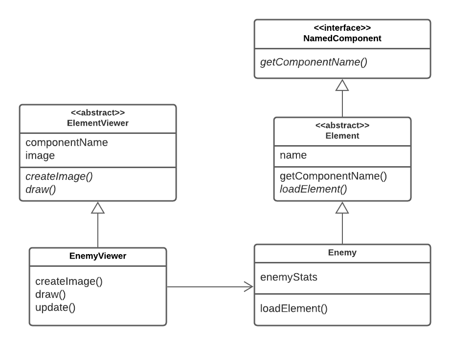

Relevant classes:

- [NamedComponent](https://github.com/FEUP-LPOO-2021/lpoo-2021-g34/blob/master/src/main/java/com/lpoo/terrarius/model/game/NamedComponent.java)
- [Element](https://github.com/FEUP-LPOO-2021/lpoo-2021-g34/blob/master/src/main/java/com/lpoo/terrarius/model/game/elements/Element.java)
- [Enemy](https://github.com/FEUP-LPOO-2021/lpoo-2021-g34/blob/master/src/main/java/com/lpoo/terrarius/model/game/elements/enemies/Enemy.java)
- [EnemyViewer](https://github.com/FEUP-LPOO-2021/lpoo-2021-g34/blob/master/src/main/java/com/lpoo/terrarius/viewer/game/EnemyViewer.java)

#### Consequences

- We can have a way to easily load models and images from files without having to know or compare the
classes of the objects we want to manage
- We are able to easily draw strings on the screen, giving useful information to the player. For example,
putting the item the hero is holding in the toolbar and displaying items in the shop
- In the classes that expect multiple types of objects and load them from a file (e.g. enemies and items), it's possible to create new
types by only creating/modifying text files, without having to even look at the source code.

   
## Known Code Smells and Refactoring Suggestions

### Data Classes
Like said above, the classes made for stats are Data Classes. This could be
a problem since they can't independently interact with their data and don't add 
operation power.

However, this smell could be justified since its functionality prevents us from having
duplicate code and decreases significantly the size of their respective classes.

Nevertheless, a way to eliminate this code smell would be to create methods so the classes
can operate on their data independently. For example, instead of updating the stats in
the Item class and creating a new Item Stats instance, we could use the Item Stats classes
to update its primitives. This, however, would decrease the importance of the Item class,
making it almost obsolete and falling in another code smell: **Lazy Class**

Another way would be to just store all the primitives in the original classes. However, this would
create the **Primitive Obsession** smell, which is, in our opinion, worse.

### Refused Bequest

This was a smell that used to appear a few items in our code and we refactored most of them.
However, there's still one class that falls under this smell: **BlockPlacer**.

This is a subclass of an **Item**, so it can be used like a regular one, mainly in the **Toolbar** class.
Still, this is not a regular item since it has no stats, meaning that they don't need to updated like other ones,
hence the empty method.

We decided to leave it this way because it's significantly easier to work with the BlockPlacer assuming
it is a regular item. So, in the end, this smell felt like a low cost against a big benefit.

### Primitive Obsession

There are currently 3 classes ([Tool](https://github.com/FEUP-LPOO-2021/lpoo-2021-g34/blob/master/src/main/java/com/lpoo/terrarius/model/game/items/tools/Tool.java), 
[Enemy](https://github.com/FEUP-LPOO-2021/lpoo-2021-g34/blob/master/src/main/java/com/lpoo/terrarius/model/game/elements/enemies/Enemy.java) 
and [Buff](https://github.com/FEUP-LPOO-2021/lpoo-2021-g34/blob/master/src/main/java/com/lpoo/terrarius/model/game/items/buffs/Buff.java))
which need to load a few values from the resources, which are all primitives (around 5) being stored in the
classes themselves. Below, we present possible solutions for this smell and a justification
of why they weren't implemented:

- **Replace data with Object**: We could move all the primitives to a separate class, like we did with the stats,
but that felt like just moving the problem rather than solving, while also increasing the number of classes in the project.
Since these 3 classes are all already pretty small, we would be creating two additional smells: a lot
of **lazy classes** and tree **Data classes**.

- **Replace it with Subclasses**: Instead of reading the values of each type from files, we could create
subclasses for all of them. This was what we tried initially but we ended up with a high density of classes,
which an **Object-Orientation Abuser** and prevented us from creating new types of objects without changing
or creating code, therefore it is an impracticable solution.
  
### Switch Statements

Since the game involves reading many keys and converting them into actions, there are switch statements
which grew fairly big, link in this GUI's [method](https://github.com/FEUP-LPOO-2021/lpoo-2021-g34/blob/74abf0e061f93e05fba145387780eacb6e99a0b7/src/main/java/com/lpoo/terrarius/gui/LanternaGui.java#L187)
Also, since the actions represent different operations in different states, there's a need to compare them,
resulting in big switch statements in states that use many of them. For example, this HeroController's
[method](https://github.com/FEUP-LPOO-2021/lpoo-2021-g34/blob/74abf0e061f93e05fba145387780eacb6e99a0b7/src/main/java/com/lpoo/terrarius/controller/game/HeroController.java#L152).

This is a smell that is very hard (or even impossible in the first case) to eliminate because we always need a place
to have a conversion table between keys and actions. If not done with a switch statement, it'd need to be done
some other way, creating a table nonetheless.

Nevertheless, a good way to combat the smell is to isolate it as much as possible, putting it in its
own method or even class.

### Long Method

This Arena's [method](https://github.com/FEUP-LPOO-2021/lpoo-2021-g34/blob/74abf0e061f93e05fba145387780eacb6e99a0b7/src/main/java/com/lpoo/terrarius/model/game/arena/Arena.java#L97)
is fairly long (around 20 lines of code), which already raises questions as to whether it should stay this way.

An easy way to fix this smell would be to split the method into smaller parts and **extract methods** from those parts.
However, we decided not to do this since the function seemed clear (even if it was long) and more methods
could start overloading the Arena class, falling into the **Large Class** smell.

## Testing

The pitest results can be found [here](https://github.com/FEUP-LPOO-2021/lpoo-2021-g34/tree/master/docs/pitest)

As we can see, we have a solid line coverage in the project,
but some tests would still benefit by being strengthened.

## Feature demonstrations

### 1 - Starting the game

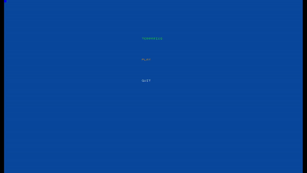

### 2 - First kill

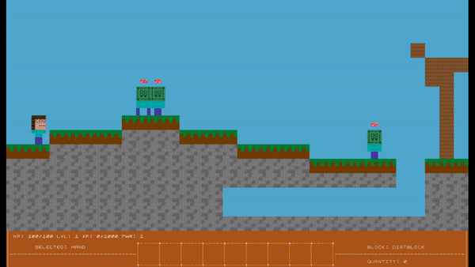

### 3 - Infinite map generation

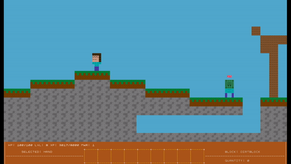

### 4 - Item shop

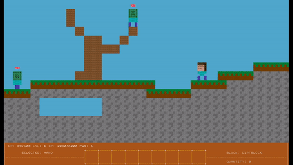

### 5 - Skill tree

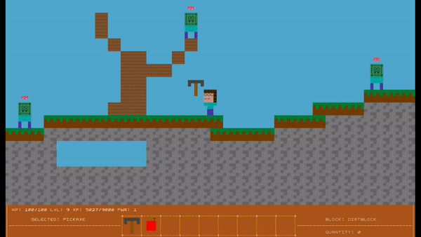

### 6 - Breaking blocks

#### 6.1 - Breaking blocks with a capable tool

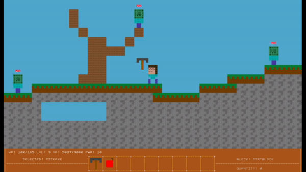

#### 6.2 - Trying to break blocks with a weak tool

### 7 - Placing blocks

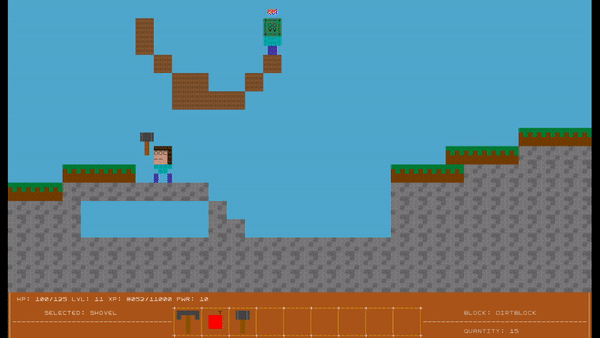

### 8 - Map unlocked by reaching level 5

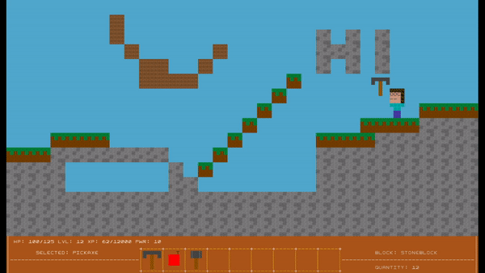

### 9 - Map unlocked by reaching level 10

### 10 - Buffs

#### 10.1 - Speed buff

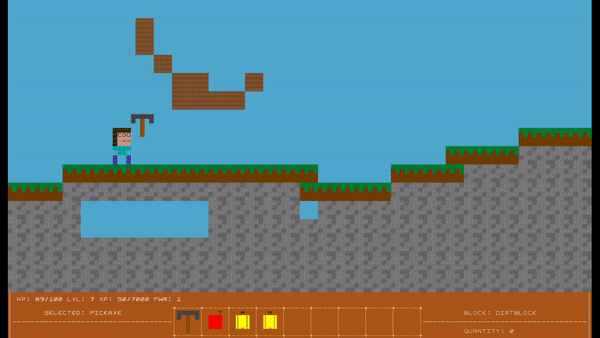

#### 10.2 - Healing buff

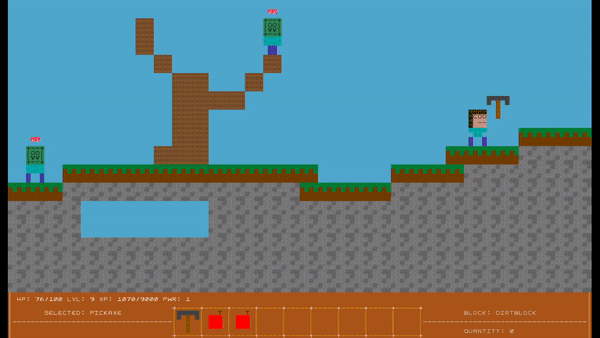

#### 10.3 - Power buff

#### 10.4 - Range buff

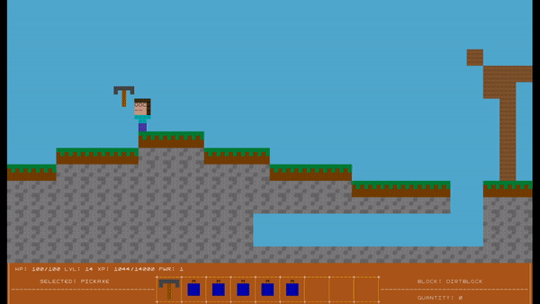

### 11 - Skills

#### 11.1 - Strength skill

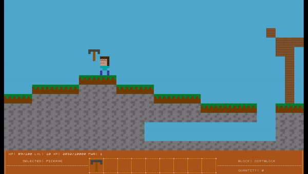

#### 11.2 - Health skill

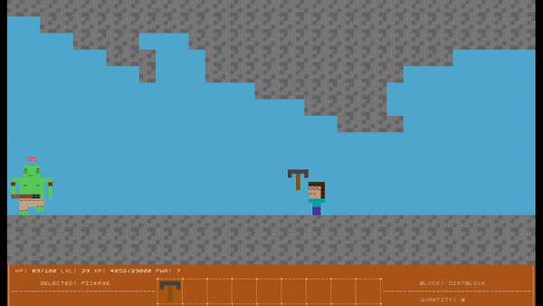

#### 11.3 - Speed skill

#### 11.4 - Range skill

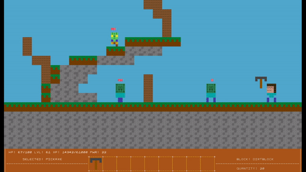

### 12 - Game Over

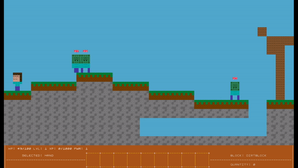

## Self-Evaluation
Bruno Rosendo: 1/3

Francisco Colino: 1/3

João Mesquita: 1/3
