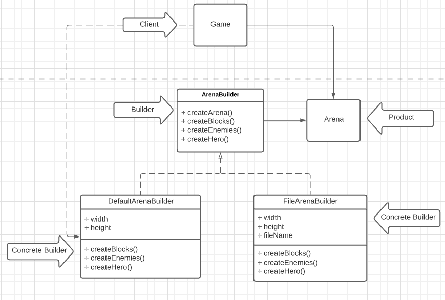

# LPOO_34 - Terraria

[PROJECT DESCRIPTION]

## Implemented Features
[WRITE HERE WHAT YOU IMPLEMENT IN CONTROLLER/VIEWERS]

**Element drawing** - Each element of the game is drawn with its own
image, represented by characters and saved in text files

## Planned Features
[WRITE HERE WHAT WE WILL DO AFTER THE FIRST DELIVERY]

## Design
[WRITE THERE EACH TIME YOU HAVE TO SOLVE A PROBLEM]

### There should be multiple ways of creating arenas

**Problem in Context:** We want to have the possibility of creating different arenas, which could be associated with a specific level / region. Additionally, we also want to introduce more flexibility so that in the future we can create the arena through different methods, for example, reading a file.

**The Pattern:**  We have applied the Builder pattern. This is a creational design pattern that lets you construct complex objects step by step. The pattern allows you to produce different types and representations of an object using the same construction code.
(Alternative: Fluent Builder pattern)

**Implementation:** This pattern suggests that we extract the object construction out of its own class and move it to separate objects called builders.

As we can see, we have an *ArenaBuilder* that knows how to create an arena (createArena method), but the way each part of the arena is built is specified in its subclasses.  

These classes can be found in the following files: 

* [ArenaBuilder](https://github.com/FEUP-LPOO-2021/lpoo-2021-g34/blob/master/src/main/java/Model/arena/ArenaBuilder.java).
* [DefaultArenaBuilder](https://github.com/FEUP-LPOO-2021/lpoo-2021-g34/blob/master/src/main/java/Model/arena/DefaultArenaBuilder.java).
* [Arena](https://github.com/FEUP-LPOO-2021/lpoo-2021-g34/blob/master/src/main/java/Model/arena/Arena.java)
* [Game](https://github.com/FEUP-LPOO-2021/lpoo-2021-g34/blob/master/src/main/java/Game.java)

**Consequences:** The use of the Builder Pattern allows the following benefits:
* Construct objects step-by-step
* Reuse the same construction code
* Single Responsability Principle. Isolate complex construction code from the logic of the Arena.

#### 

## Known Code Smells and Refactoring Suggestions
[DO IT IN THE END]

## Testing
[PUT SCREENSHOTS OF THE TESTS IN THE END]

## Self-Evaluation
Bruno Rosendo: 1/3

Francisco Colino: 1/3

João Mesquita: 1/3

**Design Patterns**

1. Model-View-Controller
    * MVC is a software design pattern commonly used to develop user interfaces that divides the related program logic into three interconnected elements (Model, View, Controller).
 
2. Factory Method
   * Factory Method is a creational design pattern that provides an interface for creating objects in a superclass, but allows subclasses to alter the type of objects that will be created.

**Code Smells**

1. Primitive Obsession
   * Signs: Use of primitives instead of small objects for simple tasks.
   * Refactor: Replace Data Value with Object.

2. Duplicate Code
   * Signs: Two code fragments look almost identical.
   * Refactor: Form Template Method.
