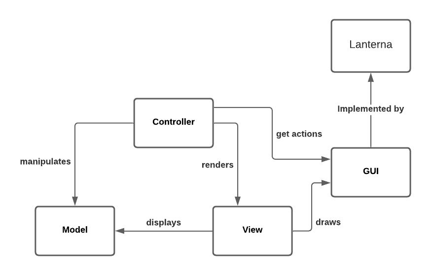
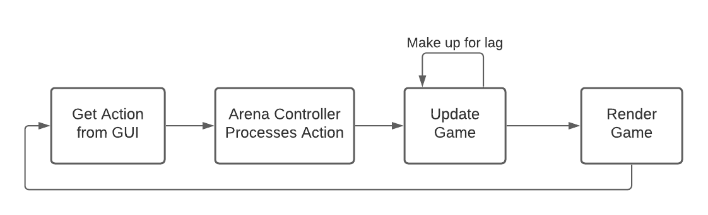
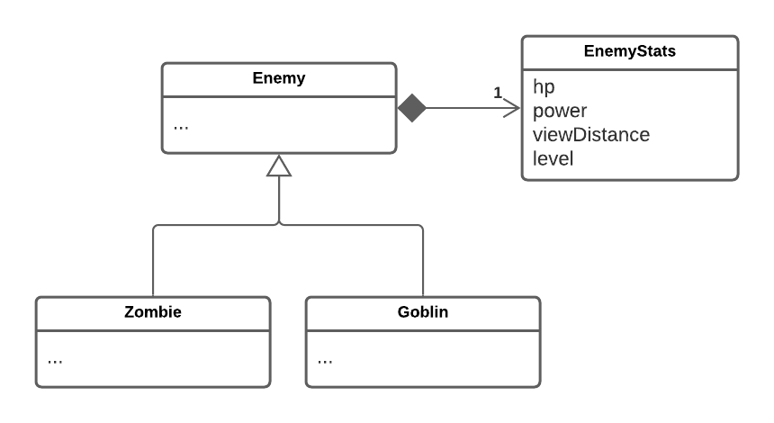
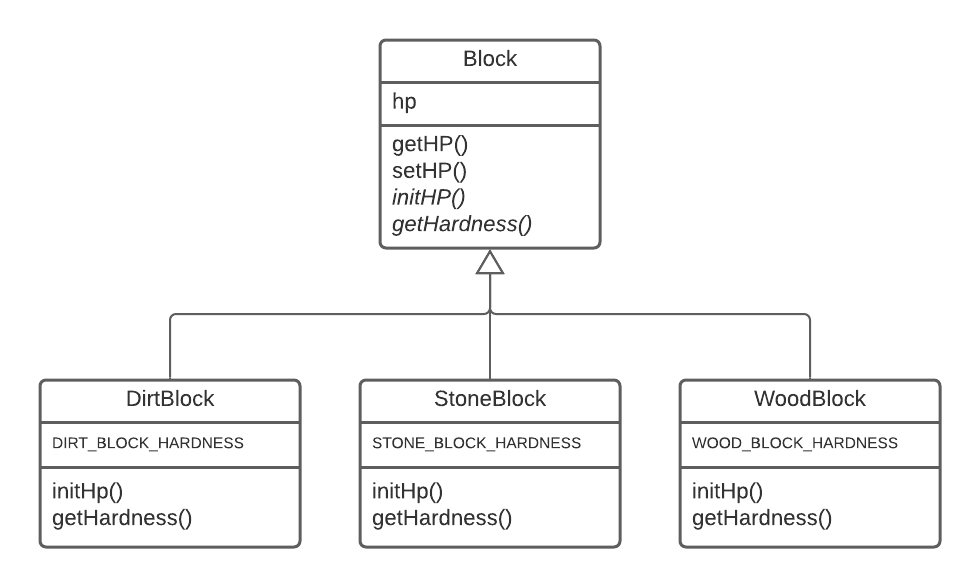
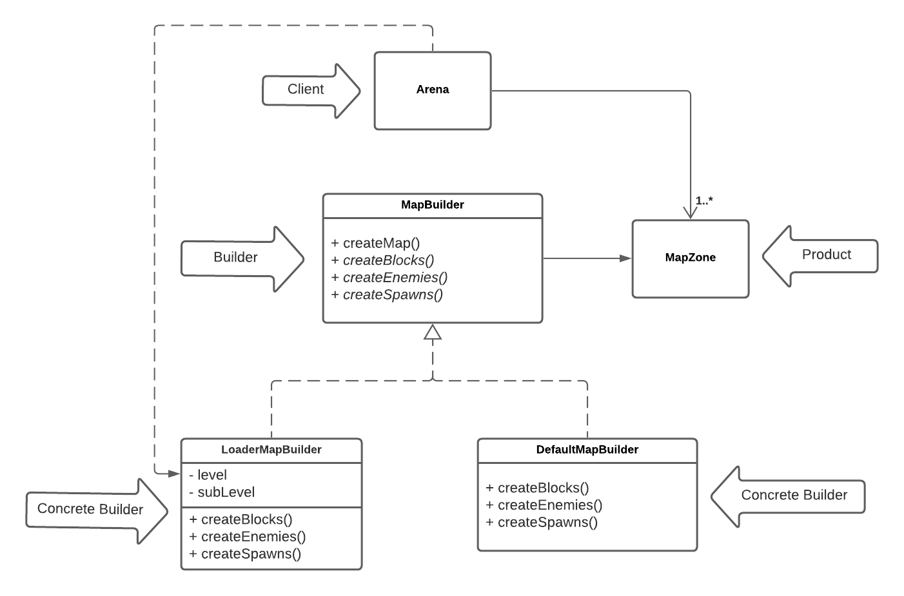
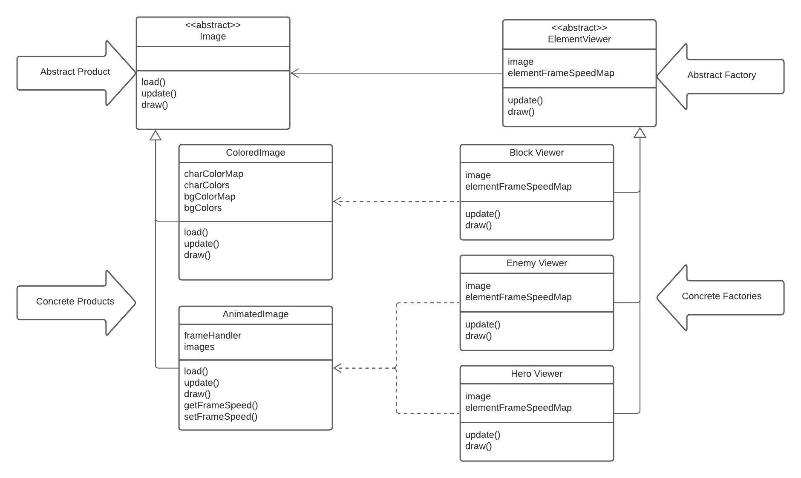
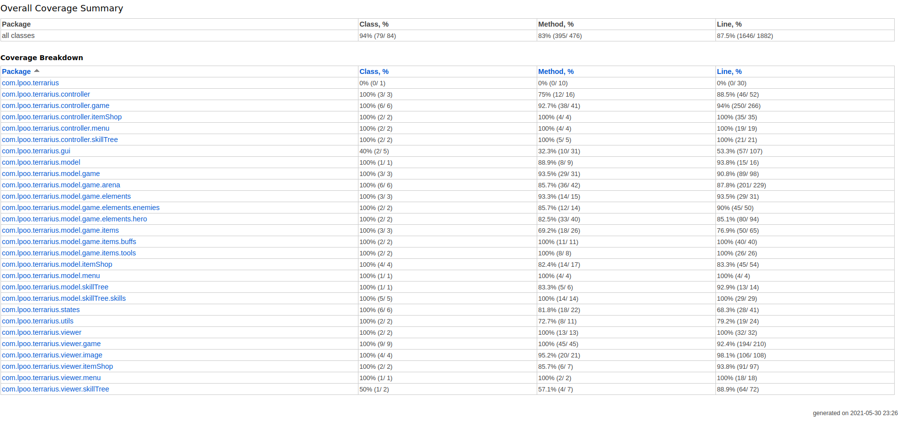
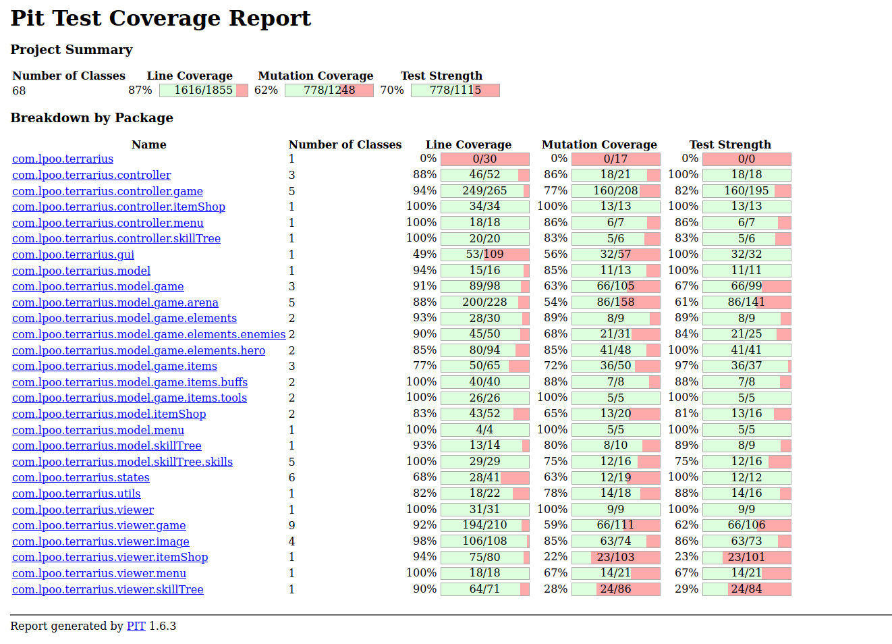

# LPOO_34 - Terraria

[PROJECT DESCRIPTION]

## Implemented Features
[WRITE HERE WHAT YOU IMPLEMENT IN CONTROLLER/VIEWERS]

**Element drawing** - Each element of the game is drawn with its own
image, represented by characters and saved in text files. Elements can be represented by static images 
or with animations.

**Arena** - Has the map, enemies and hero of our game.

**Arena Loading** - The composition of the arena is done by loading different files. These contain representation of 
the terrain of the map, the enemies and the hero, allowing the modification of the arena to be easily done.

**Hero movement** - The hero can move around the map, due to collision with blocks, according to the inputs from the 
player, up, down, left and right arrows. These movements consist of lateral movements and vertical block climbing.

**Enemy movement** - Enemies move towards the hero along the map but can't move up, just fall down, therefore they can 
sometimes be trapped.

**Tools** - Items that the hero can hold in his hand.

## Planned Features

**Breaking blocks** - The hero, when equipped with the proper tool, will be able to break blocks from the map.

**Placing blocks** - The hero will be able to place blocks, this way being able to modify the map.

## Design

### Model-View-Controller
#### Problem in context
We needed a way to represent the data, actions, input and interface of the game,
in an organized way that separates those responsibilities.

#### The Pattern
For this problem, we used the **Model-View-Controller** pattern. This way,
we stored the game data in the Model, the logic/rules of the game in the Controller and
the interface in the Viewer. Additionally, we also created a package for the GUI
since it had a different responsibility from the Viewer

#### Implementation
To implement this pattern, we created four packages: Model, View, Controller
and GUI. The implemented GUI uses Lanterna

The way they interact can be analyzed in the following diagram:

The respective packages can be found [here](https://github.com/FEUP-LPOO-2021/lpoo-2021-g34/tree/master/src/main/java)

#### Consequences
Using this pattern, we can separate the logic behind the input, processing and
interface of the game, allowing to clearly implement those modules and
making it significantly easier to make changes on them, without having to change
the others

### Game Loop Pattern

#### Problem in Context
We needed a way to faithfully update the game without depending on the CPU's clock
while also rendering images as fast as possible, so the player gets an experience as smooth
as his computer allows him

### The Pattern
The pattern (and further explanation) used can be found in the following website,
in the *Play Catch up* section:

https://gameprogrammingpatterns.com/game-loop.html

With this strategy, we have a *lag* variable counting the time passing in
each iteration and, if that variable is greater than the amount of time defined
to pass between updates (currently, 16ms), we update the actions that depend on time.
The rendering methods, on the other hand, are always called as fast as the CPU
lets them.

This way, we can have a smoother gameplay in a faster computer without
compromising the speed of the game

### Implementation
Below, we can find a flowchart which can help visualize this:

The pattern was implemented exactly like above and can be found
in the following class:

- [GameController](https://github.com/FEUP-LPOO-2021/lpoo-2021-g34/tree/master/src/main/java/Controller/GameController)

### Consequences
The use of this pattern has a lot of advantages, like:

- We can have the framerate depend almost solely on the speed of the computer. This way,
a fast computer might have 60 fps while a slow computer has 30 fps
- The speed of the game is independent of the speed of the computer. By updating
the logic of the game based on the current time, fast and slow computers will
update their games at the same time, even with different framerates
- The game won't break even if a game cycle takes more time than the theoretical
time between updates, which could happen if we simply waited for the remaining time
until the next frame (with fixed framerate)
  
However, this method also has disadvantages, since the game will update at a fixed
time step, but will render arbitrarily:

- Since the render methods will not be in sync with the update methods, faster
machines might often render moving objects at the same position they were in the last frame,
seeing that no in-game time has passed, loosing smoothness in the end
- The problem above can be atoned with an extrapolation method, which will add
a lot of smoothness to the motion. However, in some cases, this strategy can fail,
resulting in objects being rendered out of place (for example, if the object is blocked
by an obstacle). This happens because we're pretty much guessing where the object will be
in X milliseconds from now
- The extrapolation method turned out difficult to implement with the Lanterna GUI, since,
almost always, the elements only move one unit per X updates, meaning that we can't divide
their movements any further.
  
Even with these problems, the pattern is still useful in our implementation.
On one hand, the high-end users might not get too much advantage, but they still
get the best experience. On the other hand, we assure that the low-end users don't lose
any updates on their game
  

### Elements Stats

#### Problem in Context

There were some classes (namely, items and enemies) who had
a lot of primitives all related to its stats. This is a smell
called **primitive obsession**

#### The Pattern
To solve this problem, for each class falling in these circumstances,
we created a Stats class which stores all the primitives for the relevant
information

#### Implementation
This is an implementation of the *Replace Type Code with Class* refactoring

Below, there's a diagram showing how this was done in the Enemy class

The relevant classes for this pattern can be found in the following files:

- [Enemy](https://github.com/FEUP-LPOO-2021/lpoo-2021-g34/blob/master/src/main/java/Model/elements/enemies/Enemy.java)

- [EnemyStats](https://github.com/FEUP-LPOO-2021/lpoo-2021-g34/blob/master/src/main/java/Model/elements/enemies/EnemyStats.java)

- [Tool](https://github.com/FEUP-LPOO-2021/lpoo-2021-g34/blob/master/src/main/java/Model/items/tools/Tool.java)

- [ToolStats](https://github.com/FEUP-LPOO-2021/lpoo-2021-g34/blob/master/src/main/java/Model/items/tools/ToolStats.java)

- [Food](https://github.com/FEUP-LPOO-2021/lpoo-2021-g34/blob/master/src/main/java/Model/items/food/Food.java)

- [FoodStats](https://github.com/FEUP-LPOO-2021/lpoo-2021-g34/blob/master/src/main/java/Model/items/food/FoodStats.java)

#### Consequences
The use of this pattern allows for:
- The model classes don't become overflowed by primitives, becoming more
  readable and smaller

- By grouping all the stats to one class we can have all the stat generation
  together, making it easier to change, for example, how much health a zombie
  has, according to its level

- We have one more class per type of game element, but that's reasonable when
  taking into consideration the quantity of their subclasses, saving us a lot of lines

However, this also adds another code smell, **Data class**, since all
these Stats classes are mainly or only composed by primitives and their
getters/setters. Even with this problem, we believe it's worth it to use
the pattern.

### Constructors with Template Methods

#### Problem in Context
We had some abstract classes with attributes which are only defined
by their subclasses. Having that attribute in all the subclasses would
inflict against **The Release Reuse Equivalency Principle**, since we
would be writing almost identical code in each subclass

#### The Pattern
To solve this problem, we used the **Form Template Method** refactoring
to each class falling under these circumstances. This way, we only have the
relevant attributes in the abstract class and use abstract methods (which will
be overridden by the subclasses) to initialize/calculate them

#### Implementation
The following image shows how this pattern can be implemented in each class:

Below, we're linking the classes where this was applied:

- [Enemy](https://github.com/FEUP-LPOO-2021/lpoo-2021-g34/blob/master/src/main/java/Model/elements/enemies/Enemy.java)
- [Block](https://github.com/FEUP-LPOO-2021/lpoo-2021-g34/blob/master/src/main/java/Model/elements/blocks/Block.java)
- [Item](https://github.com/FEUP-LPOO-2021/lpoo-2021-g34/blob/master/src/main/java/Model/items/Item.java)

#### Consequences
The use of this pattern prevents duplicate code and allows us to easily
change how the class attributes are calculates, when they depend on subclass
implementations

### There should be multiple ways of creating arenas

**Problem in Context:** We want to have the possibility of creating different arenas, which could be associated with a specific level / region. Additionally, we also want to introduce more flexibility so that in the future we can create the arena through different methods, for example, reading a file.

**The Pattern:**  We have applied the Builder pattern. This is a creational design pattern that lets you construct complex objects step by step. The pattern allows you to produce different types and representations of an object using the same construction code.
(Alternative: Fluent Builder pattern)

**Implementation:** This pattern suggests that we extract the object construction out of its own class and move it to separate objects called builders.

As we can see, we have an *ArenaBuilder* that knows how to create an arena (createArena method), but the way each part of the arena is built is specified in its subclasses.  

These classes can be found in the following files: 

* [ArenaBuilder](https://github.com/FEUP-LPOO-2021/lpoo-2021-g34/blob/master/src/main/java/Model/arena/ArenaBuilder.java).
* [DefaultArenaBuilder](https://github.com/FEUP-LPOO-2021/lpoo-2021-g34/blob/master/src/main/java/Model/arena/DefaultArenaBuilder.java).
* [Arena](https://github.com/FEUP-LPOO-2021/lpoo-2021-g34/blob/master/src/main/java/Model/arena/Arena.java)
* [Game](https://github.com/FEUP-LPOO-2021/lpoo-2021-g34/blob/master/src/main/java/Game.java)

**Consequences:** The use of the Builder Pattern allows the following benefits:
* Construct objects step-by-step
* Reuse the same construction code
* Single Responsability Principle. Isolate complex construction code from the logic of the Arena.

### Element viewers and images

#### Problem in context

Each element, hero, enemy or block, can be visually represented by a "matrix" of characters.
A good way to store the visual representation of these elements is through files. However if we have 2 Blocks from the
same class, even though we want them to look the same, loading the files multiple times would be wasteful.

#### The Pattern

To solve this problem the **Factory Method** pattern was used. This pattern allows the creation of an interface for
creating an object but lets its subclasses determine which class to instantiate.

Further explanation can be found here: https://www.cs.unc.edu/~stotts/GOF/hires/pat3cfso.htm

#### Implementation

Diagram showing how the implementation of the factory method for ElementViewer was done.

The classes mentioned in the UML can be found in the following links:

* [Image](https://github.com/FEUP-LPOO-2021/lpoo-2021-g34/blob/master/src/main/java/Viewer/Image/Image.java)
* [ColoredImage](https://github.com/FEUP-LPOO-2021/lpoo-2021-g34/blob/mastersrc/main/java/Viewer/Image/ColoredImage.java)
* [AnimatedImage](https://github.com/FEUP-LPOO-2021/lpoo-2021-g34/blob/master/src/main/java/Viewer/Image/AnimatedImage.java)
* [ElementViewer](https://github.com/FEUP-LPOO-2021/lpoo-2021-g34/blob/master/src/main/java/Viewer/ElementViewer.java)
* [BlockViewer](https://github.com/FEUP-LPOO-2021/lpoo-2021-g34/blob/master/src/main/java/Viewer/BlockViewer.java)
* [EnemyViewer](https://github.com/FEUP-LPOO-2021/lpoo-2021-g34/blob/master/src/main/java/Viewer/EnemyViewer.java)
* [HeroViewer](https://github.com/FEUP-LPOO-2021/lpoo-2021-g34/blob/master/src/main/java/Viewer/HeroViewer.java)

#### Consequences

Advantages:

- Eliminates the need to bind application-specific classes into your code.

- Creating objects inside a class with a factory method is always more flexible than creating an object directly. 
  Factory Method gives subclasses a hook for providing an extended version of an object.
  
- The factory method doesn't have to be called by only Factories. It can also be used for parallel class hierarchies.
  (our case?)

Disavantages:

 - In order to create a Concrete Product object, the Factory class might have to be subclassed, this is a disavantage since 
   another point of evolution will have to be dealt with.
   
## Known Code Smells and Refactoring Suggestions

### Data Classes
Like said above, the classes made for Element Stats are Data Classes. This could be
a problem since they can't independently interact with their data and don't add 
operation power.

However, this smell could be justified since its functionality prevents us from having
duplicate code and decreases significantly the size of their respective classes.

Nevertheless, a way to eliminate this code smell would be to create methods so the classes
can operate on their data independently. For example, instead of updating the stats in
the Item class and creating a new Item Stats instance, we could use the Item Stats classes
to update its primitives. This, however, would decrease the importance of the Item class,
making it almost obsolete and falling in another code smell: **Lazy Class**

### Refused Bequest

Right now, the Image class has two abstract methods (*update* and *reset*) 
which are not used by one of its subclasses, StillImage
(technically, it is using them but the methods don't do anything). This is happening
for two reasons:

- So classes using images can benefit from polymorphism, by calling
those methods without having to think about what type of image they have.
  
- StillImage might use these methods for something, in the future.
This also falls a bit into the Speculative Generality smell.

A way to fix this smell would be to remove these two methods from the
Image abstract class and only implement them in the subclasses which use them.
However, this means that classes using images need to know the type of
image they're working with.

Here are the relevant classes:

- [Image](https://github.com/FEUP-LPOO-2021/lpoo-2021-g34/blob/master/src/main/java/Viewer/Image/Image.java)
- [StillImage](https://github.com/FEUP-LPOO-2021/lpoo-2021-g34/blob/master/src/main/java/Viewer/Image/StillImage.java)
- [AnimatedImage](https://github.com/FEUP-LPOO-2021/lpoo-2021-g34/blob/master/src/main/java/Viewer/Image/AnimatedImage.java)

### Comments

Since the project is in mid-development, there are some comments throughout the code reminding us
of something or explaining that some feature is still under changes (like TODOs). Here are some examples:

- [TODO](https://github.com/FEUP-LPOO-2021/lpoo-2021-g34/blob/d6a706003ecfb1c35a176f74305885d62cc7b7e2/src/main/java/Controller/EnemyController.java#L15)

- [Explanation Comment](https://github.com/FEUP-LPOO-2021/lpoo-2021-g34/blob/d6a706003ecfb1c35a176f74305885d62cc7b7e2/src/main/java/Model/items/Toolbar.java#L19)

This smell will be fixed when the features are properly implemented and the comments are removed.

### Duplicate Code

Currently, there are two classes who serve almost the same purpose: Dimensions and ImageDimensions.
 The difference between them is almost uniquely the package in which they act (Model and Viewer).

This could be fixed by defining a Dimensions class which both packaged can use (possibly, in a
common *Utils* package).

Here are the relevant classes:
- [Dimensions](https://github.com/FEUP-LPOO-2021/lpoo-2021-g34/blob/master/src/main/java/Model/Dimensions.java)
- [ImageDimensions](https://github.com/FEUP-LPOO-2021/lpoo-2021-g34/blob/master/src/main/java/Viewer/Image/ImageDimensions.java)

### Speculative Generality

Since the project is in mid-development, there are currently methods, classes and fields
which are not being used. These are usually methods/fields which were
thought useful when creating their respective classes but weren't put in execution right away,
probably because they'll serve a purpose in a feature that's yet to be implemented.

Here are some examples:

- [Toolbar item selection](https://github.com/FEUP-LPOO-2021/lpoo-2021-g34/blob/master/src/main/java/Model/items/Toolbar.java)
- [CLICK action](https://github.com/FEUP-LPOO-2021/lpoo-2021-g34/blob/d6a706003ecfb1c35a176f74305885d62cc7b7e2/src/main/java/Controller/HeroController.java#L68)
- Most of the [items](https://github.com/FEUP-LPOO-2021/lpoo-2021-g34/tree/master/src/main/java/Model/items), with the exception of the Axe

This code smell can be fixed by either implementing features which use these methods/classes or
removed them altogether, if they're not useful in the end.

## Testing

As we can see, we already have a solid line coverage in the project
but some tests still need to be strengthen.

## Self-Evaluation
Bruno Rosendo: 1/3

Francisco Colino: 1/3

João Mesquita: 1/3
